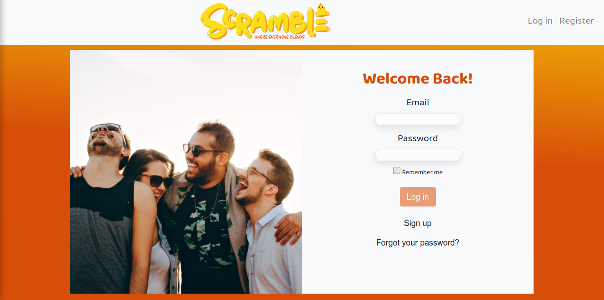
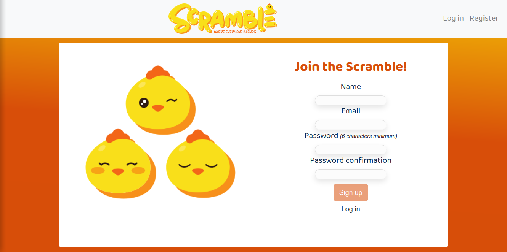
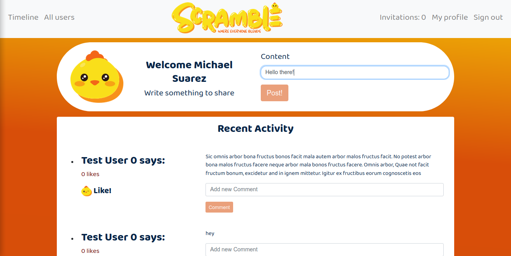
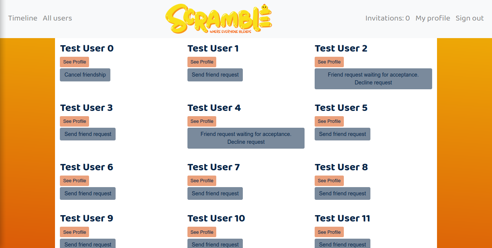
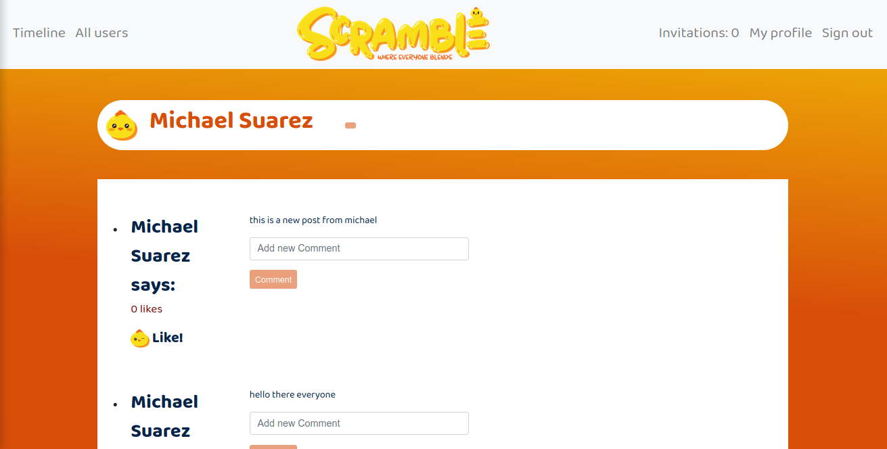

<br />
<p align="center">
  <a href="https://github.com/Usagib/ror-social-scaffold">
    
  </a>

  <h3 align="center">Scramble 'where everyone blends': Social media project on Rails</h3>

  <p align="center">
    A Ruby on Rails app for users to write posts and comment them, friend and unfriend users
    <br />
    <a href="https://github.com/microverseinc/ror-social-scaffold"><strong>Forked from »</strong></a>
    <br />
    <br />
  </p>
</p>

> This repo was forked from [Microverse ror_social_scaffold](https://github.com/microverseinc/ror-social-scaffold)

<!-- TABLE OF CONTENTS -->
## Table of Contents

* [About the Project](#about-the-project)
* [Live Demo](#live-demo)
* [How to run](#how-to-run)
* [Features](#features)
* [Screenshots](#screenshots)
* [Testing](#testing)
* [Built With](#built-with)
* [Contact](#contact)

## About The Project

A Rails app wich allows user to signup,login, view friends posts, create posts, comment them and friend and unfriend any user

## Live Demo

* [Scramble App](https://scramble-rails.herokuapp.com)

### How to run


 - Prerequisites

Ruby: 2.6.3
Rails: 5.2.3
Postgres: >=9.5


Instal gems with:

```
bundle install
```

Setup database with:

```
   rails db:create
   rails db:migrate
   rails db:seed
```


Start server with:

```
    rails server
```

Open `http://localhost:3000/` in your browser.

### Features

* Users can log into the app
* New Users can create an account
* Not logged in users can't see any posts
* Logged users can create new posts
* logged users can comment any post
* Logged users can send friend request to any user
* Logged users can accept or reject friend requests
* User profile shows events to attend and past events
* User profile shows posts created by the user
* Friendly UI lets user logically access this features

### Screenshots
Login
 
Signup
 
Timeline
 
All users
 
Profile
 

## Built With
Project built in Ruby on Rails
* [Ruby](https://www.ruby-lang.org/en/) v2.7.0
* [Rails](https://rubyonrails.org/) v5.2.4

Additional Gems used
* Bootstrap v4.0
* [DatabaseCleaner](https://github.com/DatabaseCleaner/database_cleaner)
* [Shoulda Matchers](https://github.com/thoughtbot/shoulda-matchers)
* [Capybara](https://github.com/teamcapybara/capybara)


### Testing

```
    rpsec
```
* Rspec model testing done for validation and associations
* Rspec controller testing for behaviour
* Rspec - Capybara testing for features


## Contact

Eduardo Bonilla [https://github.com/UsagiB](https://github.com/UsagiB)

Leonardo Mezu [https://github.com/leonmezu1](https://github.com/leonmezu1)


## Show your support

Give a ⭐️ if you like this project!
